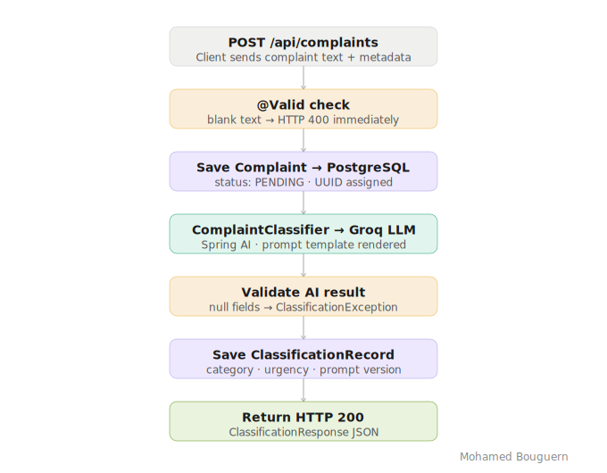
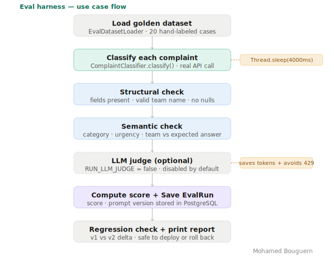
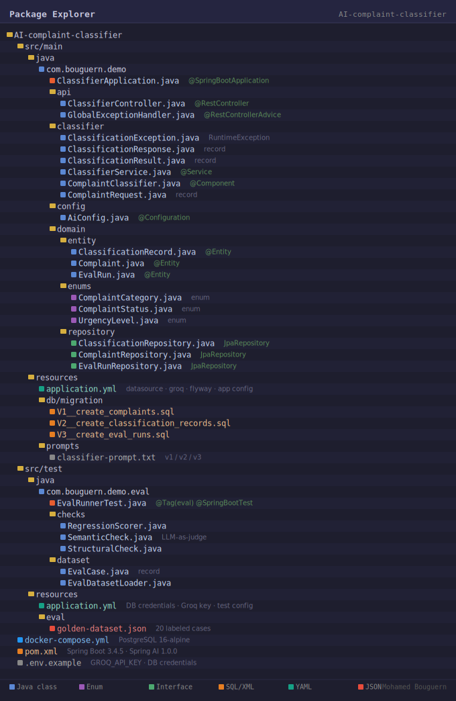

# AI Complaint Classifier

> A production-ready AI feature in Spring Boot — with a self-grading eval harness that proves it works.


> Read the full article on Medium → [Medium Article](https://medium.com/@bouguern.mohamed/building-an-ai-complaint-classifier-with-spring-ai-engineering-the-prompt-from-60-to-100-78ef812e1178)

---

A REST service that classifies customer complaints by **category**, **urgency**, and **routing team** using an LLM — and ships with a complete **evaluation harness** that scores the AI's accuracy against a hand-labeled golden dataset.

This project demonstrates three things most AI tutorials skip:

1. **Building** a real AI feature with clean architecture, validation, and persistence.
2. **Engineering** the prompt — three measured iterations taking accuracy from 60% to 100%.
3. **Evaluating** it — structural, semantic, and regression checks that turn "it looks fine" into a number.

---

## Architecture



A request flows through the standard Spring Boot layers. The eval harness lives in `src/test/` and uses the **same** `ComplaintClassifier` the production code does — it tests the real thing, not a mock.

---

## What it does

A customer sends a complaint. The service returns:

| Field          | Values                                                   |
|----------------|----------------------------------------------------------|
| `category`     | BILLING · TECHNICAL · DELIVERY · ACCOUNT · OTHER          |
| `urgency`      | LOW · MEDIUM · HIGH · CRITICAL                            |
| `suggestedTeam`| Billing / Technical / Logistics / Account / General team  |
| `reasoning`    | One sentence explaining the decision                     |

Every complaint and every classification is persisted to PostgreSQL — a full audit trail.

---

## Tech stack

- **Java 21**, **Spring Boot 3.4.5**
- **Spring AI 1.0.0** (OpenAI-compatible client)
- **Groq** as the LLM provider — `llama-3.3-70b-versatile`
- **PostgreSQL 16** + **Flyway** migrations
- **Maven** with a dedicated `eval` profile
- **JUnit 5** for the eval harness

---

## Prerequisites

Before you start, make sure you have:

- **JDK 21** or later
- **Maven 3.9+**
- **Docker** and **Docker Compose** (for PostgreSQL)
- A free **Groq API key** — get one at https://console.groq.com

---

## Quick start

### 1. Clone the repository

```bash
git clone https://github.com/<your-username>/AI-complaint-classifier.git
cd AI-complaint-classifier
```

### 2. Start PostgreSQL

```bash
docker compose up -d
```

This starts PostgreSQL 16 on port `5432` with database `complaint_db`. Flyway creates all tables automatically on first run.

### 3. Set your Groq API key

The application reads the key from the `GROQ_API_KEY` environment variable.

**macOS / Linux:**
```bash
export GROQ_API_KEY=your_groq_api_key_here
```

**Windows (PowerShell):**
```powershell
$env:GROQ_API_KEY="your_groq_api_key_here"
```

**In Eclipse:** Run Configurations → your run config → Environment tab → add `GROQ_API_KEY`.

### 4. Run the application

```bash
mvn spring-boot:run
```

The service starts on **http://localhost:9090**.

---

## Testing the API

The service exposes a single endpoint: `POST /api/complaints`.

### Example 1 — Fraud (expect BILLING / CRITICAL)

```bash
curl -X POST http://localhost:9090/api/complaints \
  -H "Content-Type: application/json" \
  -d '{
    "text": "Someone made two unauthorized purchases on my card totaling $800. I did not approve these.",
    "customerRef": "CUST-001",
    "source": "email"
  }'
```

### Example 2 — Technical failure (expect TECHNICAL / HIGH)

```bash
curl -X POST http://localhost:9090/api/complaints \
  -H "Content-Type: application/json" \
  -d '{
    "text": "The app crashes every time I open it. I reinstalled it twice and still cannot log in.",
    "customerRef": "CUST-002",
    "source": "chat"
  }'
```

### Example 3 — Phishing report (expect ACCOUNT / CRITICAL)

```bash
curl -X POST http://localhost:9090/api/complaints \
  -H "Content-Type: application/json" \
  -d '{
    "text": "I received a suspicious email asking for my password and account number claiming to be from you.",
    "customerRef": "CUST-003",
    "source": "email"
  }'
```

### Example 4 — Minor issue (expect TECHNICAL / LOW)

```bash
curl -X POST http://localhost:9090/api/complaints \
  -H "Content-Type: application/json" \
  -d '{
    "text": "Pages are loading a little slowly today. Not urgent, just mentioning it.",
    "customerRef": "CUST-004",
    "source": "form"
  }'
```

### Example 5 — Validation error (expect HTTP 400)

```bash
curl -X POST http://localhost:9090/api/complaints \
  -H "Content-Type: application/json" \
  -d '{
    "text": "",
    "customerRef": "CUST-005",
    "source": "email"
  }'
```

### Sample response

```json
{
  "complaintId": "a1b2c3d4-...",
  "category": "BILLING",
  "urgency": "CRITICAL",
  "suggestedTeam": "Billing Support Team",
  "reasoning": "Unauthorized transactions reported, requiring immediate fraud review.",
  "promptVersion": "v3"
}
```

---

## Request flow



Each request is validated, persisted, classified by the LLM, validated again, and persisted with its result — all inside one transaction.

---

## Running the eval harness

The eval harness grades the classifier against 20 hand-labeled complaints in
`src/test/resources/eval/golden-dataset.json`. It is **not** part of the normal build —
it runs only under the dedicated `eval` Maven profile.

### From the command line

```bash
mvn test -Peval
```

### From Eclipse

1. Right-click the project → **Run As** → **Maven build...**
2. **Goals:** `test`
3. **Profiles:** `eval`
4. Click **Run**

### What you'll see

```
========================================
  RESULTS - prompt v3
========================================
  Structural:  20/20
  Semantic:    20/20
  Score:       100.0%

-- Regression check --
  v2: 80.0%
  v3: 100.0%  (delta: +15.0%)
  -> Improved by +15.0% - safe to deploy
```



### Two important details

**`Thread.sleep(4000)` in `EvalRunnerTest`** — Groq's free tier caps tokens per minute.
Twenty calls in quick succession trigger `HTTP 429`. A 4-second pause between calls
keeps every request inside the rate limit, so every failure in the report is a *real*
failure — not noise. On a paid tier, remove it or use exponential backoff.

**`RUN_LLM_JUDGE = false` in `EvalRunnerTest`** — the optional LLM-as-judge makes an
*extra* API call per failed case. It is disabled by default to keep eval runs fast,
cheap, and within rate limits. Set it to `true` when you want the deeper analysis and
have the API budget for it. The judge code is fully implemented either way.

---

## Prompt versioning

The classifier's accuracy depends entirely on the prompt. This project ships **three
versions** in `src/main/resources/prompts/`:

```
prompts/
  classifier-prompt-v1.txt   ->  60%  (first attempt)
  classifier-prompt-v2.txt   ->  80%  (after first eval round)
  classifier-prompt-v3.txt   -> 100%  (production)
```

### How the active prompt is selected

`application.yml` controls which prompt file the classifier loads:

```yaml
app:
  classifier:
    prompt-version: "v3"
    prompt-file: "prompts/classifier-prompt-v3.txt"
```

And `ComplaintClassifier.java` loads it via the configurable path:

```java
// the prompt file is NOT hardcoded — it is read from application.yml
@Value("classpath:${app.classifier.prompt-file}")
private Resource promptResource;
```

> If you are upgrading from an older version of this code, replace the hardcoded
> value below:
>
> ```java
> // remove this:
> @Value("classpath:prompts/classifier-prompt.txt")
> private Resource promptResource;
>
> // replace with:
> @Value("classpath:${app.classifier.prompt-file}")
> private Resource promptResource;
> ```

### Switching versions

To test a different prompt version, change **two lines** in `application.yml`
(and `src/test/resources/application.yml` for the eval), then restart:

```yaml
app:
  classifier:
    prompt-version: "v1"
    prompt-file: "prompts/classifier-prompt-v1.txt"
```

Run `mvn test -Peval` again — the regression check compares the new run against the
previous one and tells you whether the change is safe to deploy.

---

## Project structure



The application code lives in `src/main/`. The eval harness lives in `src/test/` and
has its own `application.yml` and the golden dataset.

---

## Configuration reference

| File                                   | Purpose                                              |
|----------------------------------------|------------------------------------------------------|
| `docker-compose.yml`                   | PostgreSQL 16 container                              |
| `db/migration/V1..V3__*.sql`           | Flyway schema migrations                             |

---

## Author

**Mohamed Bouguern** — Full-Stack Java / Spring Boot developer specializing in AI integration.

Building production Java + AI systems and writing about the patterns that actually matter in enterprise environments.

- [Medium](https://medium.com/@bouguern.mohamed)
- [LinkedIn](https://www.linkedin.com/in/mohamed-bouguern/)


